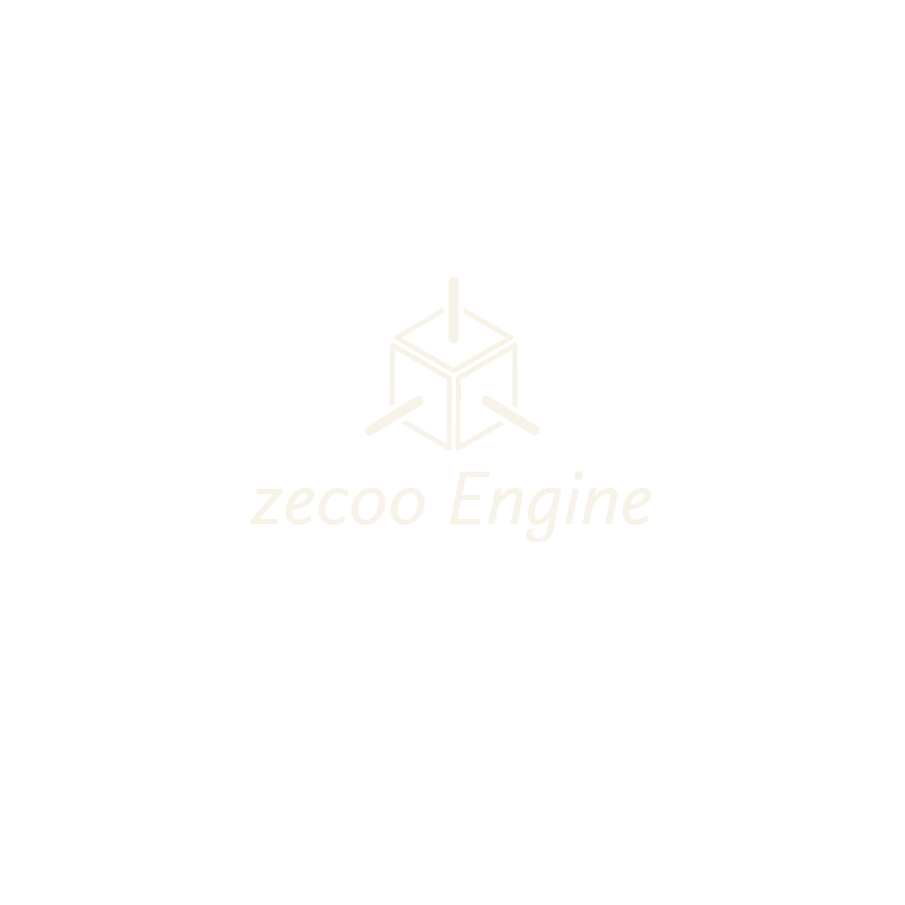

<!-- PROJECT LOGO -->
 

  
  

    An Educational Open Source 3d Graphics Engine
     
     
    <a href="https://github.com/NarinderBrar/zecooEngine/tree/master/zecooEngine/Vendor">Dependencies</a>
    ·
    <a href="https://github.com/NarinderBrar/zecooEngine/issues">Report Bug</a>
    ·
    <a href="https://github.com/NarinderBrar/zecooEngine/issues">Request Feature</a>
  

<!-- TABLE OF CONTENTS -->

Table of Contents

<li><a href="#about-the-project">About The Project</a></li>
<li><a href="#features">Features</a></li>
<li><a href="#screenshots">Screenshots</a></li>
<li><a href="#dependencies">Dependencies</a></li>
<li><a href="#requirements">Requirements</a></li>
<li><a href="#Building">Building Dependencies</a></li>
<li><a href="#contact">Contact</a></li>
<li><a href="#contributing">Contributing</a></li>

## About The Project
![Product Name Screen Shot][product-screenshot]
zecooEngine is an open-source C++ graphics engine mainly developed for educational purposes. It developed while teaching the fundamental of graphics programming. zecooEngine supports OpenGL 3.3 as a graphic API. You can draw 3d models, add lights, apply textures while creating materials. It provides features to add physics on the models using Bullet Physics Engine, can add force, apply constraints, can test collision between bodies.

(<a href="#top">back to top</a>)

## Features
<li>Draw basic primitives like cube, cone, cylinder and sphere etc.</li>
<li>Basic lighting using directional, point and spot dynamic lights.</li>
<li>Draw ray, line for debugging.</li>
<li>Rigid body dynamics: static, dynamic and kinematic bodies.</li>
<li>Collision detection with triggers and callbacks.</li>
<li>Recasting and hit testing.</li>
<li>External 3d model import via Assimp library.</li>
<li>Inputs using mouse, keyboard.</li>
<li>Inputs using mouse, keyboard.</li>

(<a href="#top">back to top</a>)

### Screenshots
Made with zecooEngine

(<a href="#top">back to top</a>)

### Dependencies
zecooEngine use multiple third-party libraries. Here is the full list of dependencies.

<li><b>GLFW</b> - Open Source, multi-platform library for OpenGL, with the API we can create windows, receiving input and events. </li>
<li><b>GLM</b> - is a header only C++ mathematics library for graphics software based on the OpenGL Shading Language (GLSL) specifications. </li>
<li><b>ImGui</b> - is a bloat-free graphical user interface library for C++. </li>
<li><b>AssImp</b> - Open Asset Import Library is a cross-platform 3D model import library which aims to provide a common application programming interface for different 3D asset file formats.</li>
<li><b>FreeImage</b> - is an Open Source library project for developers who would like to support popular graphics image formats like PNG, BMP, JPEG, TIFF and others as needed by today's multimedia applications.</li>
<li><b>Bullet3</b> - real-time collision detection and multi-physics simulation library portable file dialogs - cross-platform file dialog library.</li>

(<a href="#top">back to top</a>)

### Requirements
Software Requirements
 OS : Windows
 IDE : Visual Studio
 CMake

 Hardware Requirements
 Processor : N/A
 Graphics Card : Should supports OpenGL 3.2 and GLSL Shading language 3.3
 Ram : 4 GB or Higher

(<a href="#top">back to top</a>)

### Building
zecooEngine is distributed in source code as a Visual Studio Project 2019. 

Clone this repo to your system using 
git clone https://github.com/NarinderBrar/zecooEngine

<b>Building Dependencies</b>
<b>Build GLFW-3.3.4</b>
 Go to path \zecooEngine\Vendor\glfw-3.3.4
 Make “build” folder
 Use CMake to build Visual Studio Project 2019
 Open GLFW.sln -> Build Solution

<b>Build Bullet Physics 3.17 </b>
 Go to path \zecooEngine\Vendor\bullet3-3.17
 Make “build” dir in Bullet folder
 Use CMake to build Visual Studio Project 2019
 Open ALL_BUILD.vcxproj
 Right click -> App_HelloWorld project -> Set as Startup Project
 Right click -> App_HelloWorld project -> Properties
 C/C++ -> Code Generation -> Runtime Library -> Multi-threaded Debug DLL (/MDd)
 Repeat for BulletCollision, BulletDynamics, LinearMath

<b> Build assimp-3.3.1 </b>
 Go to path \zecooEngine\Vendor\assimp-3.3.1
 Make “build” folder
 Use CMake to build Visual Studio Project 2019
 Open ALL_BUILD.vcxproj
 build gtest
 build assimp
 copy .dll file from \zecooEngine\Vendor\assimp-3.3.1\build\code\Debug to \x64\Debug

(<a href="#top">back to top</a>)

## Contact
If you need any help please feel free to contact me at nsidhubrar@gmail.com
 you can report bugs while creating issue in this repository. 

(<a href="#top">back to top</a>)

## Contributing
As engine developed during the course, So following students contributed and provided assistance in development. 
- <a href="https://github.com/Yuvraj2705">Yuvraj Gupta</a>
- Ritik Bansal
- Vaibhav Sharma
- Ridhampreet Singh Saini
- Uddhav Jindal
- Manav Sharma
- Garvit Nangru
- Achintya Gaur
- Davesh Mehta
- Mandeep Riar
- Sarang Sharma
- Saksham P. Kumar
- Anmol Rattan Kaushal
- Anirudh Banot
- Ankur Goel
- Harneeraj Singh
- Raghav Gupta
- Manas Chakrabarti
- Rajat Sharma

(<a href="#top">back to top</a>)

<!-- MARKDOWN LINKS & IMAGES -->
[product-screenshot]: images/productImage.jpg