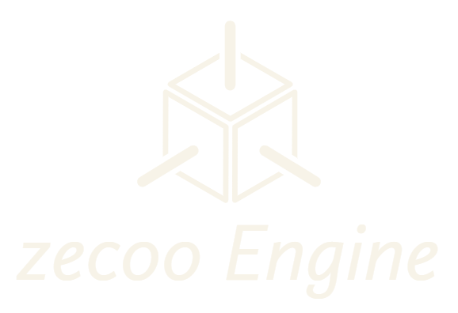

[![Contributors][contributors-shield]][contributors-url]
[![Forks][forks-shield]][forks-url]
[![Stargazers][stars-shield]][stars-url]
[![Issues][issues-shield]][issues-url]

<!-- PROJECT LOGO -->
 

  

  <h3 align="center">zecooEngine</h3>

  

    An Educational Open Source 3d Graphics Engine
     
     
    <a href="https://github.com/NarinderBrar/zecooEngine/tree/master/zecooEngine/Vendor">Dependencies</a>
    ·
    <a href="https://github.com/NarinderBrar/zecooEngine/issues">Report Bug</a>
    ·
    <a href="https://github.com/NarinderBrar/zecooEngine/issues">Request Feature</a>
  

<!-- TABLE OF CONTENTS -->

  
Table of Contents

  <ol>
    <li><a href="#about-the-project">About The Project</a></li>
    <li><a href="#features">Features</a></li>
    <li><a href="#screenshots">Screenshots</a></li>
    <li><a href="#dependencies">Dependencies</a></li>
    <li><a href="#requirements">Requirements</a></li>
    <li>
        <a href="#installing">Installing and running </a>
        <ul>
            <li><a href="#build_glfw">Build GLFW</a></li>
            <li><a href="#build_glfw">Build Bullet Physics</a></li>
            <li><a href="#build_glfw">Build Assimp</a></li>
        </ul>
    </li>
    <li><a href="#contact">Contact</a></li>
    <li><a href="#contributing">Contributing</a></li>
  </ol>

## About The Project
[![Product Name Screen Shot][product-screenshot]]
zecooEngine is an open source C++ graphics engine mainly developed for educational purpose. Its developed while teaching fundamental of graphics programming. zecooEngine supports OpenGL 3.3 as graphic API. 

(<a href="#top">back to top</a>)

## Features

<ol>
<li>Draw basic primitives like cube, cone, cylinder and sphere etc.</li>
<li>Basic lighting using directional, point and spot dynamic lights.</li>
<li>Draw ray, line for debugging.</li>
<li>Rigid body dynamics: static, dynamic and kinematic bodies.</li>
<li>Collision detection with triggers and callbacks.</li>
<li>Recasting and hit testing.</li>
<li>External 3d model import via Assimp library.</li>
<li>Inputs using mouse, keyboard.</li>
<li>Inputs using mouse, keyboard.</li>
</ol>

### Screenshots
Made with zecooEngine

### Dependencies
zecooEngine use multiple third-party libraries. Here is the full list of dependencies.

GLFW - Open Source, multi-platform library for OpenGL, with the API we can create windows, receiving input and events
GLM - is a header only C++ mathematics library for graphics software based on the OpenGL Shading Language (GLSL) specifications.
ImGui - is a bloat-free graphical user interface library for C++.
assimp - Open Asset Import Library is a cross-platform 3D model import library which aims to provide a common application programming interface for different 3D asset file formats.
FreeImage - is an Open Source library project for developers who would like to support popular graphics image formats like PNG, BMP, JPEG, TIFF and others as needed by today's multimedia applications.
Bullet3 - real-time collision detection and multi-physics simulation library
portable file dialogs - cross-platform file dialog library

(<a href="#top">back to top</a>)

### Requirements
Software Requirements
OS : Windows
IDE : Visual Studio
CMake

Hardware Requirements
Processor : N/A
Graphics Card : Should supports OpenGL 3.2 and GLSL Shading language 3.3
Ram : 4 GB or Higher

(<a href="#top">back to top</a>)

### Installation
zecooEngine is distributed in source code as a Visual Studio Project 2019. 

Step 1. Clone this repo to your system using 
git clone https://github.com/NarinderBrar/zecooEngine

Building Dependencies
Step 2 . Build GLFW-3.3.4
Go to path \zecooEngine\Vendor\glfw-3.3.4
Make “build” folder
Use CMake to build Visual Studio Project 2019
Open GLFW.sln -> Build Solution

Step 3 . Build Bullet Physics 3.17
Go to path \zecooEngine\Vendor\bullet3-3.17
Make “build” dir in Bullet folder
Use CMake to build Visual Studio Project 2019
Open ALL_BUILD.vcxproj
Right click -> App_HelloWorld project -> Set as Startup Project
Right click -> App_HelloWorld project -> Properties
C/C++ -> Code Generation -> Runtime Library -> Multi-threaded Debug DLL (/MDd)
Repeat for BulletCollision, BulletDynamics, LinearMath

Step 4 . Build assimp-3.3.1
Go to path \zecooEngine\Vendor\assimp-3.3.1
Make “build” folder
Use CMake to build Visual Studio Project 2019
Open ALL_BUILD.vcxproj
build gtest
build assimp
copy .dll file from \zecooEngine\Vendor\assimp-3.3.1\build\code\Debug
to \x64\Debug

(<a href="#top">back to top</a>)

## Contact
Contact
If you need any help please feel free to contact me : nsidhubrar@gmail.com
or you can report bugs while creating issue in this repository. 

(<a href="#top">back to top</a>)

<!-- CONTRIBUTING -->
## Contributing
Contributors
As engine developed during the course, So following students contributed and provided assistance in development. 
- To do

(<a href="#top">back to top</a>)

<!-- MARKDOWN LINKS & IMAGES -->
<!-- https://www.markdownguide.org/basic-syntax/#reference-style-links -->
[contributors-shield]: https://img.shields.io/github/contributors/othneildrew/Best-README-Template.svg?style=for-the-badge
[contributors-url]: https://github.com/NarinderBrar/zecooEngine/graphs/contributors

[forks-shield]: https://img.shields.io/github/forks/othneildrew/Best-README-Template.svg?style=for-the-badge
[forks-url]: https://github.com/NarinderBrar/zecooEngine/network/members

[stars-shield]: https://img.shields.io/github/stars/othneildrew/Best-README-Template.svg?style=for-the-badge
[stars-url]: https://github.com/NarinderBrar/zecooEngine/stargazers

[issues-shield]: https://img.shields.io/github/issues/othneildrew/Best-README-Template.svg?style=for-the-badge
[issues-url]: https://github.com/NarinderBrar/zecooEngine/issues
[product-screenshot]: images/productImage.jpg